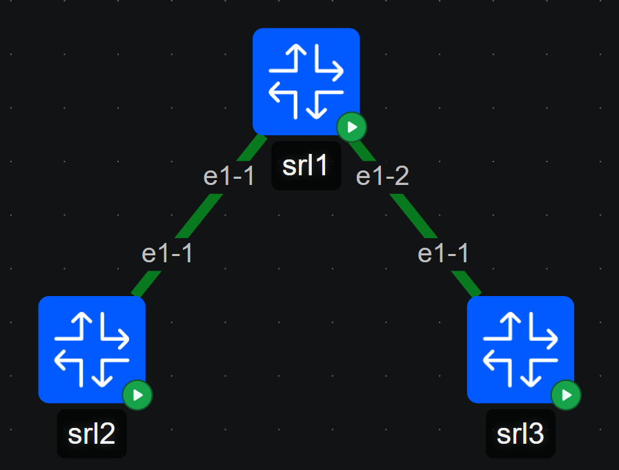

# Ansible-srl-automation-lab

## Tech Stack
* Topology: containerlab
* Automation: ansible
* Network OS: Nokia SR Linux

## Network Topology




## How to Run

1. containerlab deploy

```
containerlab deploy -t containerlab/3_srl.yml
```

2. Run Ansible Playbook 

```
ansible-playbook -i ansible/inventory/hosts.yml ansible/playbook/[name].yml
```

## Playbook Details

### ipv4_config

This playbook assigns IP addresses to the device interfaces and adds them to the default network-instance