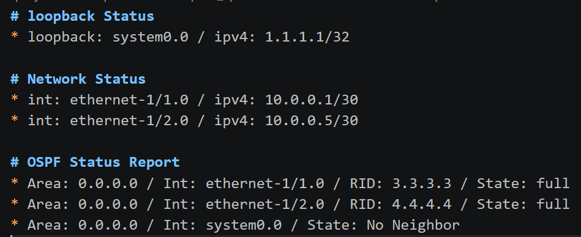
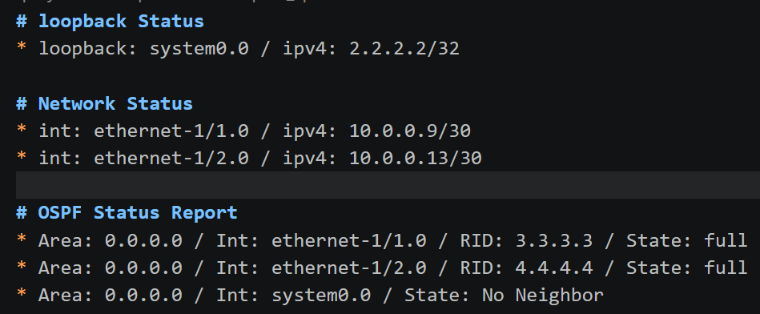
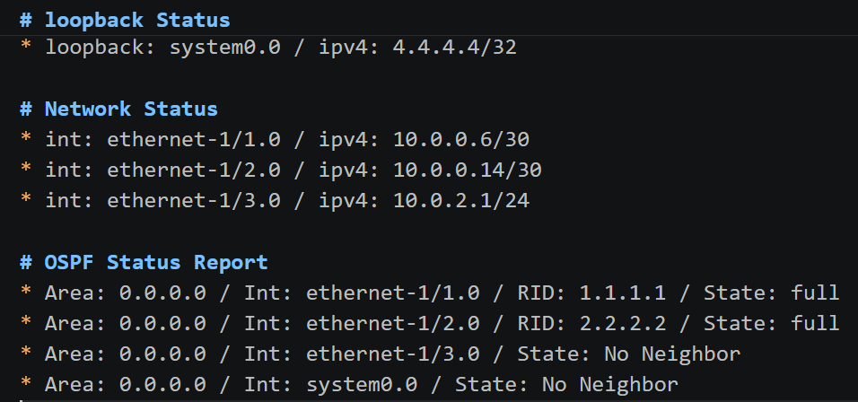

# Ansible-srl-automation-lab

# Tech Stack
* Topology: containerlab
* Automation: ansible
* Network OS: Nokia SR Linux
* Client OS: alpine

# Network Topology


# How to Run

run containerlab
```
containerlab deploy -t containerlab/srlinux_lab.yml
```


run ansible
```
ansible-playbook -i ansible/inventory/hosts.yml ansible/playbook/control.yml
```

# reports

spine1


spine2


leaf1


leaf2
